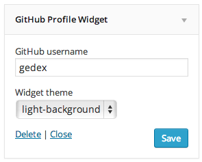

<!-- DO NOT EDIT THIS FILE; it is auto-generated from readme.txt -->
# GitHub Profile Widget

Plugin extension for GitHub API plugin for showing off GitHub profile in a widget.

**Contributors:** [akeda](http://profiles.wordpress.org/akeda)  
**Tags:** [github](http://wordpress.org/plugins/tags/github), [profile](http://wordpress.org/plugins/tags/profile), [widget](http://wordpress.org/plugins/tags/widget)  
**Requires at least:** 3.6  
**Tested up to:** 3.9  
**Stable tag:** trunk (master)  
**License:** [GPLv2 or later](http://www.gnu.org/licenses/gpl-2.0.html)  
**Donate link:** http://goo.gl/DELyuR  

## Description ##

The profile appearance mimics the profile page in GitHub. You just simply enter GitHub username and theme for the widget to show off the GitHub profile in a widget.

This plugin depends on [GitHub API](http://wordpress.org/plugins/github-api/) plugin. Make sure to install and activate that first.

**Development of this plugin is done on [GitHub](https://github.com/gedex/wp-gh-profile-widget). Pull requests are always welcome**.

## Installation ##

1. This plugin depends on **GitHub API** plugin, so make sure it's installed and activated.
1. Upload **GitHub Profile Widget** plugin to your blog's `wp-content/plugins/` directory and activate.
1. The widget is now available with the name **GitHub Profile Widget** in your **Appearance** > **Widgets**

## Screenshots ##

### Widget with "dark-background" theme rendered in twentyfourteen

### Widget with "light-background" theme rendered in twentytwelve

### Widget instance

## Changelog ##

### 0.2.0 ###
* Removes octicons as it's now being registered by github-api plugin
* Enqueues styles only when the widget is active

### 0.1.0 ###
Initial release

